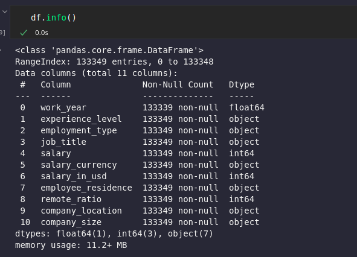
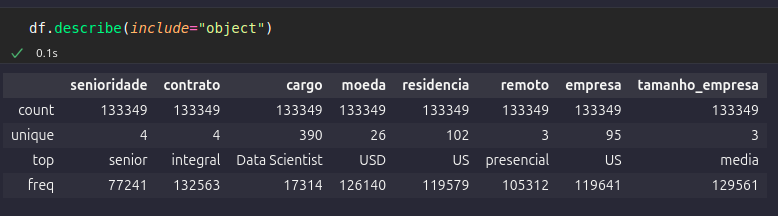

# 01 Explore dados com Pandas
## Sumário 
- [Introdução](#1-introdução)
- [Links Importantes](#2-links-importantes-para-você-acompanhar-a-aula)
- [Mergulhe mais profundo](#3-mergulhe-mais-profundo)
- [Notações da Aula](#4-notações-da-aula)
  - [Configuração de ambiente](#41-configuração-de-ambiente)
  - [Importando e visualizando dados](#42-import-e-visualização-de-dados)
  - [Acessando as informações](#43-acessando-informações)
  - [Manipulando a base](#44-manipulando-o-dataframe)
    - [Comando rename](#441-comando-rename)
    - [Value count e replace](#442-comandos-value_counts-e-replace)
  - [Describe include](#45-comando-describe-parâmetro-include)
---
Chegou a hora de mergulhar na Imersão Dados com Python da Alura! Em poucos dias, você vai aprender na prática como coletar, tratar, analisar e visualizar dados com Python, uma das linguagens mais usadas no mundo dos dados. Cada aula foi pensada para você colocar a mão na massa e desenvolver projetos reais, passando por etapas essenciais da análise de dados. Preparado para dar o próximo passo na sua jornada? Vamos nessa?

__key_word = PANDAS__

## 1. Introdução
Na primeira aula, você vai aprender a carregar arquivos CSV no Google Colab e iniciar a análise de dados com Pandas. Usando comandos simples, começará a manipular bases reais, preparando os dados para análises mais profundas e identificação de padrões no mercado de trabalho.

### Nesta aula, você vai:
- Aprender como carregar arquivos CSV no Google Colab de forma prática.
- Utilizar a biblioteca Pandas para leitura e visualização inicial de dados.
- Manipular dados reais com os principais comandos de análise.
---
## 2. Links importantes para você acompanhar a aula
- [Pandas Python: o que é, e para que serve e como instalar](https://www.alura.com.br/artigos/pandas-o-que-e-para-que-serve-como-instalar)
- [Python: a origem do nome](https://www.alura.com.br/artigos/python-origem-do-nome)
- [Guia de mergulho](https://grupoalura.notion.site/Imers-o-Dados-com-Python-Guia-de-Mergulho-226379bdd09b808ca2e3d4d95a56b1ce?source=copy_link)
- [link do projeto](https://github.com/guilhermeonrails/idcp-alura/blob/T8R7W1/Todas_as_aulas_Imers%C3%A3o_dados_com_Python_Alura_Agosto_2025.ipynb)
- [kaggle](https://www.kaggle.com/)
--- 
## 3. Mergulhe mais profundo
- [O que é ciência de dados?](https://www.alura.com.br/artigos/ciencias-dados)
- [Google Colab: o que é, tutorial de como usar e criar códigos](https://www.alura.com.br/artigos/google-colab-o-que-e-e-como-usar)
Divulgue seu projeto
Quem compartilha seus projetos ganha mais visibilidade no mercado! Poste seu progresso no LinkedIn e use a hashtag #imersao-dados-python para interagir com outros devs e até chamar atenção de recrutadores!

Estamos ansiosos para mergulhar em aprendizado junto com você! Bom mergulho e até a próxima aula.

---
## 4. Notações da Aula
### 4.1 Configuração de ambiente
Durante a [Aula 1 ](#01-explore-dados-com-pandas) foi utilizado o [Google-colab](https://colab.research.google.com/), porém utilizarei o `VsCode`, devido a costume de utilização do mesmo, durante esse processo será utilizado tanto arquivos com a extensão de `ipynb`, para maior similaridade como também utilizarei de *"virtual enviroment ou venv"*, para tal, utilizando o comando:  

```bash
# Sintaxe padrão é: python -m venv <nome do ambiente>
python3 -m venv venv

# Para ativar ambiente, caso esteja
# linux ou caso esteja utilizando o git-bash 
source venv/bin/activate

# Para desativar o ambiente criado o comando é 
deactivate

```
Pós criação do *"ambiente virtual"*, assim como foi utilizado durante a aula, também irei realizar a importação da biblioteca `pandas` para o python, para tal o comando a ser utilizado no bash é o seguinte. 

```bash
#Instalação da biblioteca pandas no ambiente virtual com ele ativo
pip install pandas
# Instalação da biblioteca ipykernel no ambiente virtual com ele ativo.
# Nécessário realizar em caso de utilização de arquivos ipynb
# PS o Vscode cria automaticamente, porém para fins de conhecimento o mesmo foi instalado
pip install ipykernel

python -m ipykernel install --user --name=nome-projeto-venv --display-name="nome=pra-selecao-de-kernel (.venv)"

```
> __PS:__ É valido ressaltar que para utilização do comando acima, somente é possível dessa forma em Linux pois foi criando um ambiente virtual, como foi optado pela utilização de arquivos em `ipynb` foi necessário junto a instalação da biblioteca pandas a `ipykernel`, para rodar os códigos. Devido ao processo de seleção de Kernel do Jupyter notebook, o ultimo comando se mostrou necessário para que o processo de execução do notebook ocorra corretamente.

Também foi realizado o comando abaixo, para facilitar o processo de import das bibliotecas utilizadas no código da aula.
```bash
pip freeze > requirements.txt
```

Assim como feito no coolab ou em Jupyter Notebook (como está sendo utilizado para esse repositório), seguirei a prática de __uma célula para cada trecho de código__ 

### 4.2 Import e visualização de dados
para realizar o "import" da base de dados foi utilizado um arquivo `csv` que foi disponibilizado no [repositório do git](https://raw.githubusercontent.com/guilhermeonrails/data-jobs/refs/heads/main/salaries.csv), é valido ressaltar, que assim como um a biblioteca pandas, pode realizar a leitura de arquivos localmente a mesma também consegue realizar essa leitura com : `pd.read_csv`, de arquivos não locais. 
Por padrão no pandas o head(), irá mostrar as 5 primeiras linhas, porém um dos parâmetros aceitos para esse método é a quantidade de linhas serão exibidas. podendo utilizar então `df.head(10)` da maneira como está escrito será exibido no visualizador do notebook, as 10 primeiras linhas do arquivo, sendo que na primeira coluna teremos como um  `id` de cada linha e lembrando que assim como em outras linguagens, a contagem também é inicializada a partir do 0. 
Tal qual pode ser utilizado em código python `.py` quando estamos querendo saber a classe de um objeto com a função built-in do type, temos dentro da biblioteca pandas, o método `info`, nesse método tera como seu retorno de forma visual informações sobre a base de dado que está sendo trabalhada.  

<table style="text-align: center; width: 100%;"> 
<tr>
    <td style="text-align: center;">
    
    </td>
</tr>
</table>

Conforme, imagem anexo, diferente da utilização do `head()` que fara uma especie de "print" em tela da base a ser trabalhada, o `info()` trata as colunas existentes no arquivo porém com informações *técnicas*, como o tipo de dado se é null ou não  etc..  

### 4.3 Acessando informações
Dando continuidade outro comando importante a ser utilizado quando não se conhece a base de dados, e o comando `df.describe()`,a priore desse comando veremos todas as colunas numéricas(float ou int) presentes no dataframe, e através desse método irá retornar, algumas informações descritivas, trazendo por exemplo a contagem de linhas, a media, o mínimo, a média e etc.. é possível também utilizar esse comando com informações textuais ou categorias, como por exemplo a frequência de apresentação.  

também é possível realizar a impressão do tamanho da base através do método/propriedade  `df.shape` __sem parenteses__ pois trata-se de um `@property` da biblioteca, com essa propriedade teremos em formato de tupla o total de linhas, e colunas respectivamente nessa ordem.
ainda no âmbito de conhecimento de `@property` do pandas, temos o `df.columns` que tera como retorno dos nomes existentes no dataframe. 

### 4.4 Manipulando o Dataframe 
### 4.4.1 Comando rename 
Agora para renomear as colunas, podemos realizar a manipulação do dataframe, é  utilizado o comando `rename` conforme exemplo abaixo:
```py
# Dicionário de renomeação
novos_nomes = {
    'work_year': 'ano',
    'experience_level': 'senioridade',
    'employment_type': 'contrato',
    'job_title': 'cargo',
    'salary': 'salario',
    'salary_currency': 'moeda',
    'salary_in_usd': 'usd',
    'employee_residence': 'residencia',
    'remote_ratio': 'remoto',
    'company_location': 'empresa',
    'company_size': 'tamanho_empresa'
}

# Aplicando renomeação
df.rename(columns=novos_nomes, inplace=True)

# Verificando resultado
df.head()
```
No exemplo de código acima, foi realizado os seguintes passos, primeiro foi criado um dicionário(chave-valor), com os nomes das colunas que podem ser visualizados com a propriedade `columns` do pandas, para realizar uma tradução dos nomes existentes das colunas para o Português-Br, 
posteriormente foi utilizado o método de `rename`, no qual foi repassado 2 parâmetros, sendo eles 
> columns atribuindo o valor do dicionário , e inplace como true.
Como estamos realizado tal aplicação para conhecimento da biblioteca, o `inplace` foi passado como true, para de fato substituir os valores no arquivo, porém __essa utilização não é uma boa prática.__

### 4.4.2 Comandos value_counts e replace
Conforme dito anteriormente , para informações *textuais* é possível também realizar estatísticas de frequência sobre uma categoria, para tal realiza-se o seguinte comando 
```py 
df.['column_name'].value_counts()
```
No comando acima, estaremos realizando o acesso de uma coluna especifica do dataframe (identificado pelos `[]` e nome ali contido) e, e utilizamos o método `value_counts()`, nesse método é demonstrado uma contagem / frequência de apresentação dos valores da coluna. 

Ainda para manipulação da base de dados, para melhor compreensão dos dados e por assim dizer *tratamento das informações*, para realizar por exemplo a substituição de valores existentes nas colunas o método a ser utilizado será o `replace`, conforme código abaixo:
```py
senioridade = {
    'SE': 'senior',
    'MI': 'pleno',
    'EN': 'junior',
    'EX': 'executivo'
}
df['senioridade'] = df['senioridade'].replace(senioridade)
df['senioridade'].value_counts()
```
Assim como foi feito para renomear as colunas do dataframe, aqui foi realizado um dicionário, para realizar um *"de para"* das siglas de uma coluna, para um texto mais descritivo, após a criação desse dicionário, está sendo acessado a coluna do dataframe `df['column_name']` e atribuído a mesma a própria coluna porém com a utilização do método `replace`, onde está sendo passado como parâmetro o dicionário criado, para esse caso poderíamos utilizar o método `map` 

### 4.5 Comando describe parâmetro include
Voltando ao método `descibre` quando utilizado com o parâmetro de  `include="object"` a sua apresentação diverge da anteriormente vista,  com essa utilização teremos dados estatísticos diferentes cujo os quais também irão incluir as colunas textuais esses resultados são:  
- count = Contagem geral por coluna presente no dataframe
- unique = COntagem de valores únicos existentes por coluna. 
- top = Irá demonstrar por coluna qual é o valor mais frequente na coluna apresentada
- freq = Irá demonstrar a frequência  do valor mais frequente se repete (informação na linha top)

<table style="text-align: center; width: 100%;"> 
<tr>
    <td style="text-align: center;">
    
    </td>
</tr>
</table> 

---
código da aula [aqui](src/explore_dados_com_pandas.ipynb)

---
<table style="text-align: center; width: 100%;"> 
<caption><b>Skils do projeto </b></caption>
<tr>
    <td style="text-align: center;">
    
    </td>
    <td style="text-align: center;">
    
    </td>
    <td style="text-align: center;">
    
    </td>
<tr> 
</table>


---
Titulo: 01 Explore dados com Pandas

Autor: Thierry Lucas Chaves

Data criacao: 05/08/2025

Data modificacao: 06/08/2025

Versao: 1.0  

---