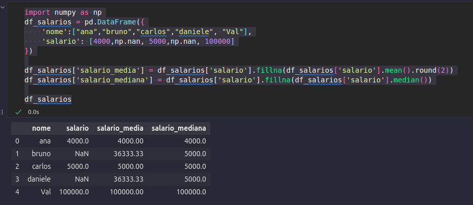
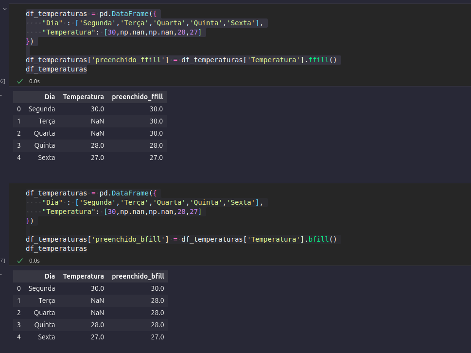
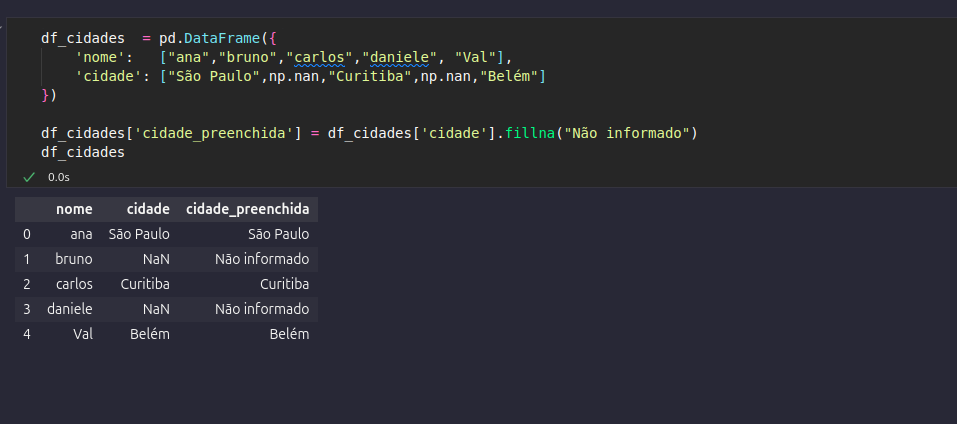
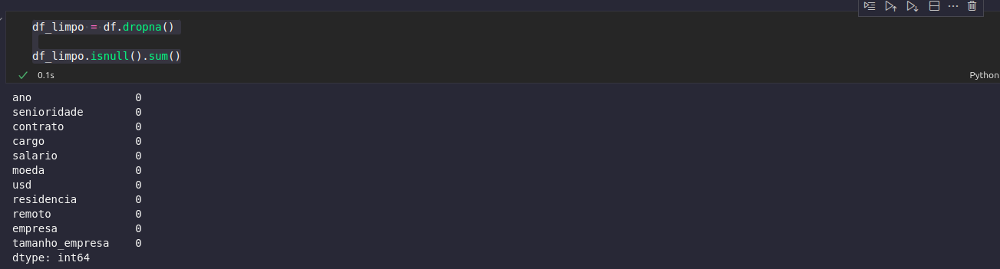
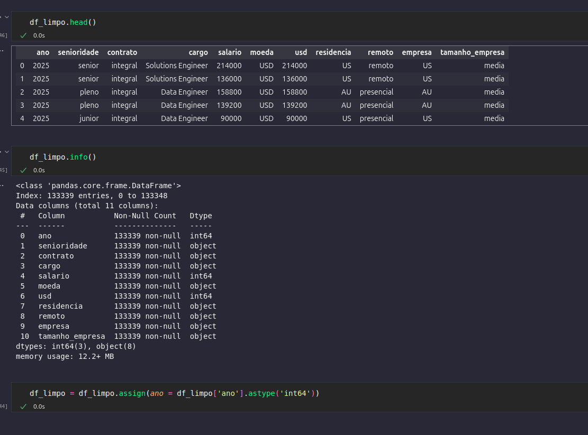

# 2 Aprenda a limpar e preparar dados
## Sumário 
- [Introdução](#1-introdução)
- [Links Importantes](#2-links-importantes-para-você-acompanhar-a-aula)
- [Mergulhe mais profundo](#3-mergulhe-mais-profundo)
- [Notações da Aula](#4-notações-da-aula)
  - [Preparação e limpeza](#41-preparação-e-limpeza-dos-dados)
    - [isnull](#411-isnull)
  - [Tratando dados nulos](#42-tratando-os-dados-nulos)
    - [Preenchendo informações vazias](#421-preenchendo-informações-vazias)
    - [Preenchendo com a média](#422-preenchendo-com-a-média)
    - [Preenchendo com ultimo valor](#423-preenchendo-com-a-ultimo-valor)
    - [Preenchendo com valor fixo](#424-preenchendo-com-valor-fixo)
    - [Deletando valores nulos](#425-retirando-valores-nulos)
    - [Modificando tipo de dado](#426-normalizando-dados)

---
Boas-vindas à sua próxima aula! Chegou a hora de mergulhar na segunda aula da Imersão Dados com Python e avançar mais um nível na sua jornada profissional. Vamos nessa?
__key_word = PRINT__
## 1. Introdução
Nesta aula, você vai aprender a tratar dados de forma mais estruturada, preparando a base para análises mais assertivas. O foco está em identificar e lidar com dados faltantes, organizar colunas, aplicar filtros e gerar estatísticas descritivas que ajudam a entender melhor os dados e extrair insights relevantes.  

### Nesta aula, você vai:
- Aprender técnicas para renomear colunas de maneira clara e organizada. 
- Identificar e tratar dados faltantes em bases rais. 
- Aplicar filtros simples para selecionar informações relevantes. 
- Gerar estatísticas descritivas que apoiam a análise e tomada de decisão. 

---
## 2. Links importantes para você acompanhar a aula
- [Pandas: Limpeza e tratamento de dados](https://www.alura.com.br/conteudo/pandas-limpeza-tratamento-dados)
--- 
## 3. Mergulhe mais profundo
- [Como remover linhas e colunas no Pandas](https://www.alura.com.br/artigos/como-remover-linhas-e-colunas-no-pandas)
- [Estatística descritiva: o que é e quais os tipos de medidas de tendência central](https://www.alura.com.br/artigos/estatistica-descritiva)
---
## 4. Notações da Aula
### 4.1 Preparação e limpeza dos Dados

O primeiro passo a ser feito, ao se iniciar no tratamento de dados, e a verificação de de dados nulos dentro do dataframe, para tal é utilizado o comando `isnull`, porém caso o dataframe contenha um grande número de informações, a maneira mais fácil de realizar essa conferencia, seria através de uma estrategia de contagem de *"dados"* ausentes, isso pode ser feito através dos comandos `isnull` e `sum`
ficando da seguinte forma :
```py
df.isnull().sum()
```
### 4.1.1 isnull

Dentro da estratégia de verificação de dados, após identificar as colunas que potencialmente contêm valores nulos, podemos investigar quais são os valores existentes. Utilizando o comando .unique() em uma coluna específica, conseguimos visualizar todos os seus valores distintos, o que nos ajuda a entender a natureza dos dados e dos próprios valores ausentes.  
De posse dessa informação, podemos aplicar filtros para isolar e exibir apenas as linhas que contêm esses dados nulos. Um comando poderoso para isso é:
```py
df[df.isnull().any(axis=1)]
```
No comando acima, aplicamos um filtro para que sejam exibidas todas as __linhas__ que contenham __pelo menos um campo nulo.__  
O comando segue uma cadeia de precedência lógica, que é mais fácil de entender de dentro para fora:
1. A operação inicia com `df.isnull()`. Neste trecho, estamos dizendo ao código para criar uma "máscara" de todo o DataFrame, onde cada célula que estiver vazia (nula) é marcada como True e cada célula preenchida é marcada como `False`.

2. Posteriormente, utilizamos o método `.any(axis=1)` sobre essa máscara. Com ele, estamos especificando que a operação deve ocorrer ao longo das colunas para cada linha `(axis=1), verificando se **"algum (any)"** dos valores na linha é True. O resultado disso é uma nova lista (uma Série booleana) que nos diz True para as linhas que têm pelo menos um nulo e False para as que não têm.

3. Por fim, essa lista de `True e False` é usada como um filtro dentro dos colchetes do DataFrame original `(df[...])`. O resultado final é a exibição de todas as linhas completas do DataFrame df que continham True no passo anterior, ou seja, as linhas que possuem pelo menos um valor nulo.

Em resumo, estou aplicando um filtro avançado na base de dados. A condição para o filtro é gerada pela verificação de quais células são nulas `(.isnull())` e, em seguida, pela checagem de quais linhas contêm ao menos uma dessas células nulas`(.any(axis=1))`, exibindo-as por completo.

### 4.2 Tratando os dados nulos
Após verificação de quais dados estão nulos precisamos de maneiras de tratar tais informações, para tal podem ser feitos 3 tipos de tratamento (conforme dito na aula), sendo eles inserir informações onde **não há**, deletar essa informações, ou realizar esse input(inserção) com base em alguma regra *"mais ou menos inteligente"*. 
### 4.2.1 Preenchendo informações vazias
Uma das maneiras que podemos utilizar em determinados casos pode ser através da média ou mediana daquela coluna de informação, em um cenário que por exemplo tenhamos valores vazios no campo de salário, poderíamos utilizar dessas estrategia de preenchimento com base na média ou mediana da informação, 
### 4.2.2 Preenchendo com a média
Visto que na base atual não temos valores nulos no campo de salários, para melhor exemplificar a utilização desta estrategia criaremos um novo DataFrame, para exemplificar um cenário como este:  
```py
import numpy as np
df_salarios = pd.DataFrame({
    'nome':["ana","bruno","carlos","daniele"],
    'salario': [4000,np.nan, 5000,np.nan]
})

df_salarios['salario_media'] = df_salarios['salario'].fillna(df_salarios['salario'].mean().round(2))

df_salarios
```
No cenário do código acima, criamos um novo DataFrame chamado de `df_salarios`. Para isso, utilizamos o método `pd.DataFrame()`, e o preenchemos como um dado do tipo dicionário combinado com uma lista de valores, onde as chaves serão as colunas e a lista serão as linhas ou células.   

De posse dessa nova base de dados, aplicamos o conceito de preenchimento de nulos. O comando se inicia com o a criação de uma nova coluna para essa base caracterizada por `df_salarios['salario_media']`, que receberá os valores gerados pelos comandos seguintes: 
O preenchimento dela utiliza uma cadeia de métodos:

1. **df_salarios['salario']** =  Nesse trecho, estamos informando que a base para nossa operação serão os valores da coluna **salario** do nosso DataFrame. É a partir dela que faremos o preenchimento.

2. **fillna()** = Em seguida, aplicamos este método à coluna salario. Ele é responsável por gerar uma nova Série (uma cópia da coluna salario), onde os valores nulos (NaN) são substituídos pelo argumento que passamos para ele. Os valores que não são nulos são mantidos como estão.  

3. **df_salarios['salario'].mean().round(2)** = Este é o argumento que passamos para o .fillna(). Ele calcula o valor que será usado para preencher os NaNs. A lógica é:
  -`df_salarios['salario'].mean()`: Calcula a média de todos os valores não-nulos da coluna salario. (Neste caso, a média de 4000 e 5000, que é 4500).
  - `.round(2)`: Arredonda o resultado dessa média para duas casas decimais.

Ou seja, estamos criando uma nova coluna chamada salario_media. O valor atribuído a ela é o resultado da coluna salario após uma operação: o método .fillna() pega cada valor da coluna salario original e, somente se o valor for nulo (NaN), ele o substitui pela média calculada (4500.00). Se o valor não for nulo, ele o mantém.
Caso necessário poderíamos utilizar também a mediana dos valores, para que não fossem gerados valores *"outliers"*(fora da serie), e acabassem "contaminando" o base com tais valores, para isso as únicas alterações necessárias da linha 2 do exemplo seriam:  
1. Adicionar uma nova coluna para tal o nome dentro de `df_salarios['salario_media']`, seria modificado 
2. O comando responsável pelo calculo seria o `median()`
Conforme exemplo abaixo 
> PS: no código utilizamos a biblioteca numpy, para realizar a inserção de valores nulos diretamente nas colunas.
```py
import numpy as np
df_salarios = pd.DataFrame({
    'nome':["ana","bruno","carlos","daniele", "Val"],
    'salario': [4000,np.nan, 5000,np.nan, 100000]
})

df_salarios['salario_media'] = df_salarios['salario'].fillna(df_salarios['salario'].mean().round(2))
df_salarios['salario_mediana'] = df_salarios['salario'].fillna(df_salarios['salario'].median())

df_salarios
```

<table style="text-align: center; width: 100%;"> 
<tr>
    <td style="text-align: center;">
    
    </td>
</tr>
</table>

A imagem acima, exemplifica o cenário descrito dos valores outliers, quando possuímos um valor muito destoante dos demais, esse valor poderá subir ou alterar a média como um todo, o que pode gerar um valor impreciso.

### 4.2.3 Preenchendo com a ultimo valor
Outra estrategia que pode ser utilizada, e a de preenchimento com o método `ffill()`, para melhor exemplificação desse método utilizaremos o seguinte comando:
```py
df_temperaturas = pd.DataFrame({
    "Dia" : ['Segunda','Terça','Quarta','Quinta','Sexta'],
    "Temperatura": [30,np.nan,np.nan,28,27]
})

df_temperaturas['preenchido_ffill'] = df_temperaturas['Temperatura'].ffill()
df_temperaturas
```
Conforme feito no [preenchimento com a média/mediana](#422-preenchendo-com-a-média), criamos um data frame novo, e criamos uma nova coluna, porém ao invés de utilizar o preenchimento dessa nova coluna, com a média ou mediana utilizamos o método `ffill()`, que fazer o `forward fill` , ou seja ele completa os valores Nan com o valor anterior. em casos de não existir valor anterior podemos utilizar o método `bfill`, que basicamente busca o próximo valor não nulo onde o b do método vem de `back fill`

```py
df_temperaturas = pd.DataFrame({
    "Dia" : ['Segunda','Terça','Quarta','Quinta','Sexta'],
    "Temperatura": [30,np.nan,np.nan,28,27]
})

df_temperaturas['preenchido_bfill'] = df_temperaturas['Temperatura'].bfill()
df_temperaturas
```
<table style="text-align: center; width: 100%;"> 
<tr>
    <td style="text-align: center;">
    
    </td>
</tr>
</table>


### 4.2.4 Preenchendo com valor fixo
Conforme feito no [preenchimento com a média/mediana](#422-preenchendo-com-a-média), criamos um data frame novo, e criamos uma nova coluna, porém ao invés de utilizar o preenchimento dessa nova coluna, com a média ou mediana utilizamos o método `fillna` também , porém ao invés de passar como argumento um calculo ou algo do tipo, utilizaremos um valor fixo para esse preenchimento
```py
df_cidades  = pd.DataFrame({
    'nome':   ["ana","bruno","carlos","daniele", "Val"],
    'cidade': ["São Paulo",np.nan,"Curitiba",np.nan,"Belém"]
})

df_cidades['cidade_preenchida'] = df_cidades['cidade'].fillna("Não informado")
df_cidades
```
Nesse exemplo acima, a única diferença dos exemplos anteriores se dá no argumento do método fillna, onde foi passado textualmente o valor de `Não informado`
<table style="text-align: center; width: 100%;"> 
<tr>
    <td style="text-align: center;">
    
    </td>
</tr>
</table>

### 4.2.5 Retirando valores nulos
Voltando ao exemplo da base utilizada originalmente, dado ao contexto do alto número de informações existentes e do baixo valor de informações nulas, a estrategia a ser utilizada será a de exclusão de informação.Para a adoção desse processo o método a ser utilizado é o seguinte:

```py
df_limpo = df.dropna()
```
Neste comando estamos criando um novo dataframe, e aplicando a ele todo valor do data frame original porém com o método `dropna()`, irá atribuir somente os as linhas que tiverem valor em todas colunas. tal processo pode ser conferido através do método de contagem anteriormente utilizado `df_limpo.isnull().sum()` resultando em 0 em todas as contagem de valores nulos
<table style="text-align: center; width: 100%;"> 
<tr>
    <td style="text-align: center;">
    
    </td>
</tr>
</table>

### 4.2.6 Normalizando dados 
Ao analisar os dados percebesse que a coluna de ano está constando como float64, ou seja decimal, o que não seria o ideal para esse tipo de informação sendo assim realizaremos a transformação desses dados  para inteiro, o que seria mais condizente para esse tipo de dado. 
Para tal tuitaremos o método assing :
```py
df_limpo = df_limpo.assign(ano = df_limpo['ano'].astype('int64'))
```
No exemplo em questão estamos fazendo o seguinte:
1. atribuindo um novo valor a base de dados. 
2. informamos que ela recebera ela mesmo porém reconfigurado caracterizado pelo método `assing()`
3. Como argumentos definimos com parâmetros o seguinte:
  - ano = E terminando aqui conforme as colunas existentes no df, que no caso seria a coluna ano
  - atribuímos a essa nova coluna a ser criada, que ela recebera toda a coluna ano anteirior.
  - `.astype('int64')` = Define que o tipo é inteiro 

<table style="text-align: center; width: 100%;"> 
<tr>
    <td style="text-align: center;">
    
    </td>
</tr>
</table>

---


<table style="text-align: center; width: 100%;"> 
<caption><b>Skils do projeto </b></caption>
<tr>
    <td style="text-align: center;">
    
    </td>
    <td style="text-align: center;">
    
    </td>
    <td style="text-align: center;">
    
    </td>
<tr> 
</table>

---
Titulo: 2 Aprenda a limpar e preparar dados

Autor: Thierry Lucas Chaves

Data criacao: 05/08/2025

Data modificacao: 07/08/2025

Versao: 1.0  

---