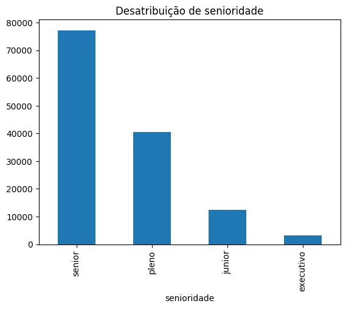
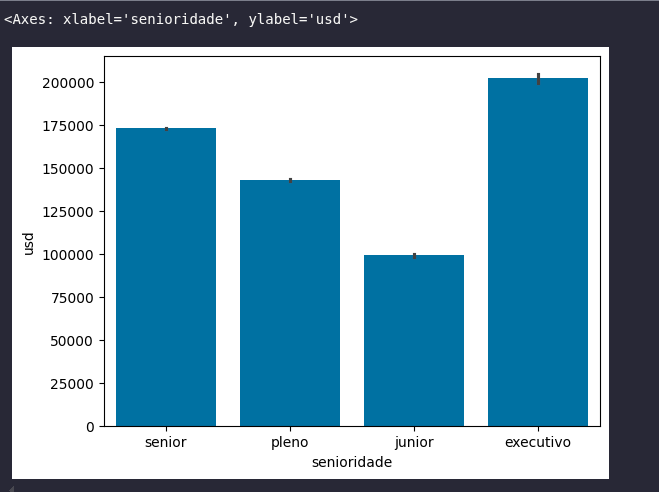
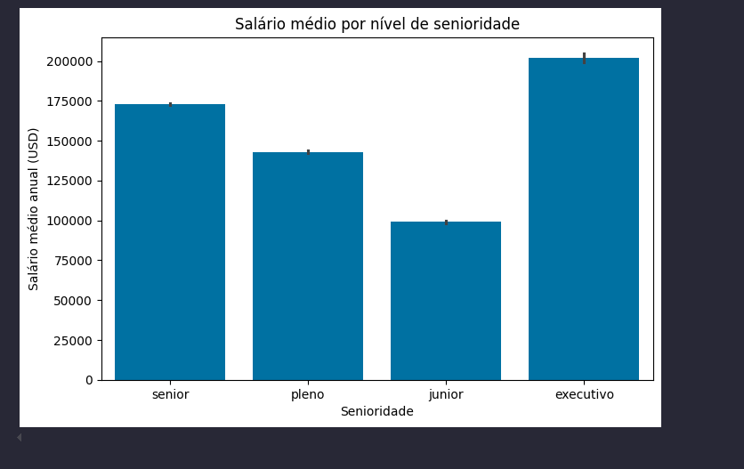
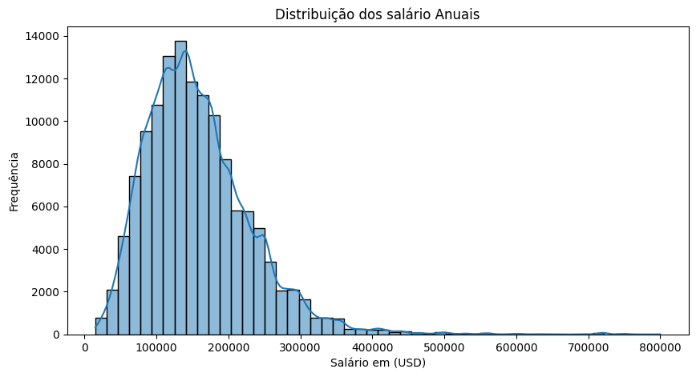
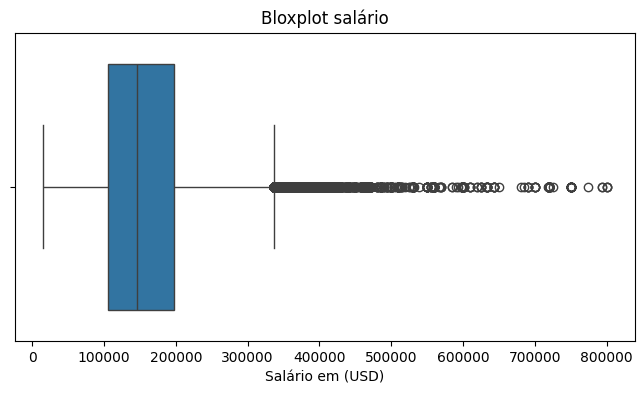
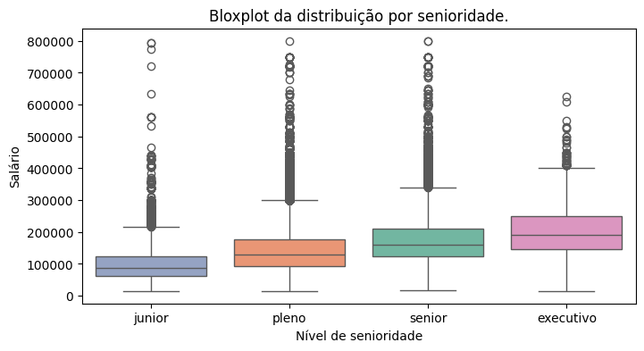
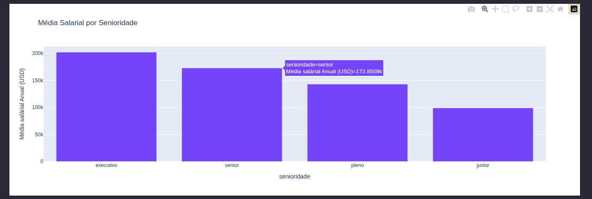
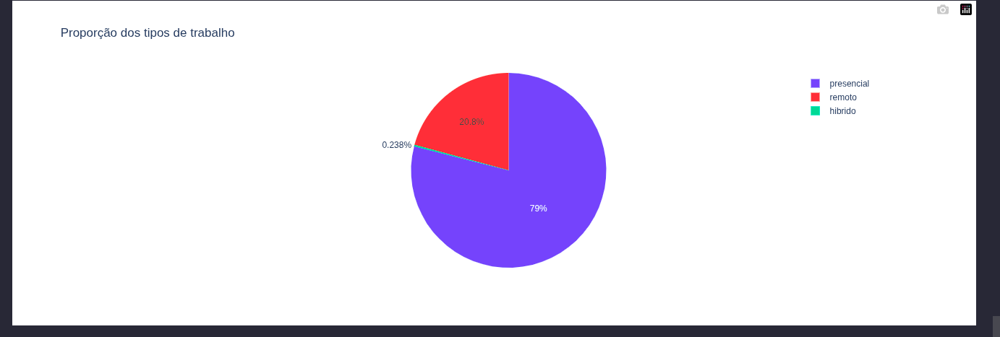
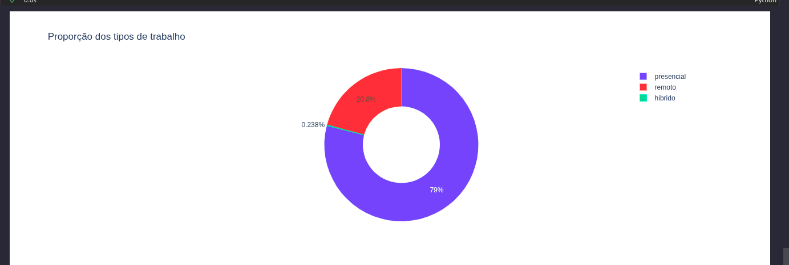
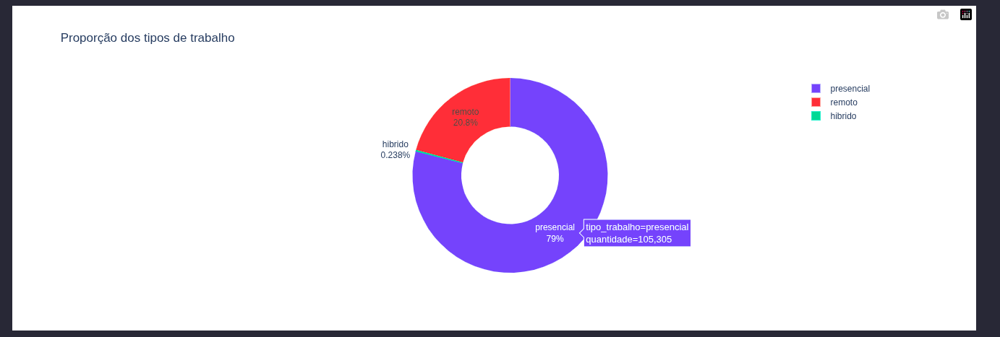

# 3 Crie Gráficos e conte histórias com Dados

## Sumário 
- [Introdução](#1-introdução)
- [Links Importantes](#2-links-importantes-para-você-acompanhar-a-aula)
- [Mergulhe mais profundo](#3-mergulhe-mais-profundo)
- [Notações da Aula](#4-notações-da-aula)
  - [Gráficos com pandas](#41-gráficos-com-pandas)
    - [Customizando gráfico](#42-customizando-gráficos)
      - [Barras](#421-gráficos-em-barras)
        - [Seaborn](#4211-seaborn)
        - [Matplotlib](#4212-matplotlib)
        - [Groupby pandas](#4213-groupby-pandas)
      - [Histograma](#422-histograma)
      - [roundbloxplot](#423-roundbloxplot)
    - [Gráficos interativos](#43-gráficos-interativos)
      - [Gráficos interativos em barras](#431-gráfico-interativo-em-barras)
      - [Gráficos em pizza](#4311-gráfico-pizza)
---
Boas-vindas à sua próxima aula! Chegou a hora de mergulhar na terceira aula da Imersão Dados com Python e avançar mais um nível na sua jornada profissional. Vamos nessa?
__key_word = MATPLOTLIB__

## 1. Introdução
Nesta aula, você vai aprender a criar gráficos para visualizar e explorar informações presentes nos dados. Vamos explorar diferentes tipos de gráficos estatísticos como: histogramas, boxplots e gráficos de barras. Esse passo é importante para identificar padrões, facilitar a interpretação e comunicar os resultados de forma mais clara.
### Nesta aula, você vai:
- Criar gráficos estatísticos para analisar os dados de forma visual. 
- Construir histogramas para observar a distribuição das informações. 
- Utilizar bibliotecas de Python que ajudam na criação de gráficos. 
- Praticar a visualização de dados para apoiar a análise e tomada de decisões. 

---
## 2. Links importantes para você acompanhar a aula
- [Histograma: o que é, exemplos, gráficos e tipos](https://www.alura.com.br/artigos/o-que-e-um-histograma)
- [Melhorando a análise com o Boxplot](https://www.alura.com.br/artigos/melhorando-a-analise-com-o-boxplot)
--- 
## 3. Mergulhe mais profundo
- [Visualizando informações com um gráficos](https://www.alura.com.br/artigos/visualizando-informacoes-com-um-grafico)
- [Data Visualization: conhecendo as bibliotecas do Python](https://www.alura.com.br/artigos/data-visualization-conhecendo-bibliotecas-python)
---
## 4. Notações da Aula
Nesta aula será realizado o processo de *'plot'* dos dados,esse *'plot'* das informações e de suma importância, pois aproxima o que pode ser denominado de usuário de informações para tomada de decisão. 
### 4.1 Gráficos com pandas 
Através da biblioteca pandas, é possível realizar o plot de gráficos sem a necessidade de outras bibliotecas, pois a mesma já possui nativamente métodos para tal, é valido ressaltar que:  
<div style="border-left: 4px solid red; background-color:rgb(22, 23, 24); padding: 10px;">
  <strong style="color: red;">E valido ressaltar. </strong>
  <p> Apesar de possuir, métodos, para realizar o plot de dados, não é possível realizar grandes customizações nativamente com pandas.
  Outro ponto valido de ser ressaltado, e de que apesar de não precisar importar diretamente outro biblioteca no código, como para acompanhamento 
  desta aula estou utilizado o Vscode, fez-se necessário a instalação da biblioteca matplotlib
  </p>
</div> 

```bash 
pip install matplotlib
```

Para demonstrar tal, poderio da biblioteca, será utilizado o método `plot`, e gerado um gráfico com base na coluna de *"senioridade"*, presente na base, para utilização de tal método esperasse a passagem de alguns argumentos, sendo obrigatório a passagem do parâmetro `kind` que é responsável por determinar qual será o gráfico a ser exibido. 
```py
df_limpo["senioridade"].value_counts().plot(kind='bar',title='Desatribuição de senioridade')
```
<table style="text-align: center; width: 100%;"> 
<tr>
    <td style="text-align: left;">
    
    </td>
</tr>
</table>

### 4.2 Customizando gráficos
Conforme ressaltado no tópico anterior, mesmo através do pandas, durante a execução do código foi necessário realizar a instalação da biblioteca `Matplotlib`, mesmo que essa não tenha sido importada diretamente no código 
```py 
import Matplotlib
```
Porém dentro do universo de *"plot"* de gráficos em Python, essa biblioteca é bastante conhecida e utilizada, bem como também a biblioteca  `Seaborn`, que foi instalada no ambiente virtual para eventual utilização.   
Porém antes de ser repassado os comandos para utilização com esse métodos, é sempre bom ressaltar que apesar de ter ferramentas mais sofisticadas, que permitem customizações mais elaboradas em gráficos, e sempre bom ter em mente a seguinte pergunta __`Qual problema deve ser resolvido ?`__, para o exemplo a sendo utilizado na aula, estamos utilizando uma base de dados real que a priore demonstra um problema de RH de empresa, pois a base em questão condiz com a distribuição de profissionais em dados pelo mundo. 

### 4.2.1 Gráficos em Barras
### 4.2.1.1 Seaborn
Diferentemente da biblioteca pandas, cuja a qual nos oferece uma utilização mais básica dos dados, com a lib `seaborn`, é possível realizar a implementação de gráficos mais elaborados, incrementado os gráficos com estatísticas dos dados, como por exemplo um gráfico de desvio padrão. 
Para demonstração inicial iremos utilizar assim como no exemplo anterior o gráfico do tipo barras, para tal a sintaxe do comando segue o seguinte padrão de argumentos:
```py 
import seaborn as sns 

sns.barplot(data=df_limpo, # base de dados a ser plotada
          x='senioridade', # dados que serviram como construção de eixo X (horizontal)
            y='usd'        # dados que serviram como construção de eixo y (vertical)
            )
```
<table style="text-align: center; width: 100%;"> 
<tr>
    <td style="text-align: left;">
    
    </td>
</tr>
</table>

### 4.2.1.2 Matplotlib 
Agora quando queremos customizar o gráfico afim de trazer mais clareza aos dados *"plotados"*, podemos utilizar a biblioteca `Matplotlib`, em conjunto com a `Seabron`, 
<div style="border-left: 4px solid red; background-color:rgb(22, 23, 24); padding: 10px;">
  <strong style="color: red;">E valido ressaltar. </strong>
  <p> Tanto a biblioteca <b>Pandas</b>, quando a <b>Seabron</b>, utilizam em background, se assim 
  podemos dizer a biblioteca <b>matplotlib</b>, 
  </p>
</div> 

```py
import matplotlib.pyplot as plt

plt.figure(figsize=(8,5))
sns.barplot(data=df_limpo,x='senioridade',y='usd')
plt.title("Salário médio por nível de senioridade")
plt.xlabel("Senioridade")
plt.ylabel("Salário médio anual (USD)")
plt.show()
```
Descrevendo melhor os comandos listados acima temos a utilização de __`5 métodos`__ novos apresentados, todos esses pertencendo a matplotlib(apelidade de plt) sendo eles:
1. `plt.figure(figsize=(8,5))` = Esse método é utilizado para determinar o tamanho do gráfico a ser utilizando, através do argumento `figsize`,onde o primeiro elemento representa a largura e o segundo a altura da figura, em polegadas. 
2. `plt.title` = Esse método é utilizado para determinar o titulo do gráfico a ser plotado, nele passamos no exemplo acima somente um argumento como um *string*, informando qual será o titulo do gráfico em questão. 
3. `plt.xlabel & plt.ylabel` = Esses métodos são utilizados para determinar os labels, das dimensões utilizadas na montagem do gráfico, sendo para o eixo horizontal e vertical *(x e y)* respectivamente, ou seja são os rótulos  para melhor descrever o que está sendo representado em cada dimensão, e assim como no title ele recebeu apenas um argumento como uma `string`, informando quais serão essas rótulos. 
4. `plt.show()` = Esse método é responsável pela apresentação do gráfico em sí, apesar de que no ambiente do `jupyter notebook`somente passando com os comandos do exemplo acima o gráfico em sí ser apresentado, o método em questão apresenta o gráfico com a diferença de que não são apresentados informações acima do gráfico do texto sobre o objeto. 
<table style="text-align: center; width: 100%;"> 
<tr>
    <td style="text-align: left;">
    
    </td>
</tr>
</table>

### 4.2.1.3 groupby pandas
E uma boa pratica para melhor apresentação dos gráficos a serem plotados que as informações sejam de fácil compreensão, e uma das formas para melhorar tal visualização do gráfico a ser apresentado e que as informações estejam ordenadas ou exibidas como por exemplo do maior para o menor valor.  
Para a aplicação dessa boa prática podemos utilizar o método `groupby` do pandas, esse método realiza não somente agrupamentos das informações como ordenações das informações, esses agrupamentos sempre serão feitos com base em alguma estatística, no exemplo criado, realizaremos a média do salário por nível de senioridade, após a obtenção desse dados ordenaremos do maior para menor valor. 
Para execução desse processo a sintaxe dos comandos será a seguinte:
```py
ordemn = df_limpo.groupby('senioridade')['usd'].mean().sort_values(ascending=False).index
``` 
Explicando o código acima: 
1. `df_limpo.groupby()` = Esse trecho é responsável por realizar o agrupamento dos dados. 
2. `('senioridade')['usd'].mean()` = Já nesse trecho passamos como argumento direto qual será o dado a ser agrupado ('senioridade'), em seguida, qual a condição de agrupamento ['usd'], por fim informamos com a utilização do método `mean()`, que iremos realizar a média desse valor. 
3. `sort_values(ascending=False)` = Esse método é responsável por realizar a ordenação dos valores, como argumento estamos informado ao método que a ordenação do método em questão Não será de forma ascendente `ascending=False`
4. `index` = Como estamos atribuindo o comando em questão para um variável utilizamos o método `index` para juntar toda esse trecho de código, esse método/proprety irá transformar todo esse data frame, em uma lista na ordem da informação que foi gerada, 
Todo esse comando em questão foi utilizado para realizar a passagem de um outro parâmetro ao método `sns.barplot`, que é o argumento de `order= `. 
```py 
plt.figure(figsize=(8,5))
sns.barplot(data=df_limpo,x='senioridade',y='usd',order=ordem) # parâmetro order está recebendo a variável de lista para definir a ordenação
plt.title("Salário médio por nível de senioridade")
plt.xlabel("Senioridade")
plt.ylabel("Salário médio anual (USD)")
plt.show()
```

### 4.2.2 Histograma 
Assim como visto anteriormente a montagem padrão do gráfico seguira o padrão visto até aqui, porém a diferença será explicitamente a utilização de outro método da `Seaborn`, para esse exemplo utilizaremos o método de `sns.histplot`. Para realizar o plot de um gráfico em formato de histograma seguiremos a seguinte sintaxe:
```py 
plt.figure(figsize=(8,4))
sns.histplot(df_limpo['usd'], bins=50, kde=True)
plt.title("Distribuição dos salário Anuais")
plt.xlabel("Salário em (USD)")
plt.ylabel("Frequência")
plt.show()
```
no método em questão estamos utilizando 3 argumentos sendo eles:
1. Qual será a informação do dataframe será utilizado, divergindo do comando atenriormente que passavamos primariamente qual o data frama que seria utilizado, aqui já informamos diretamente qual informação dentro da base de dados desejamos. 
2. `bins` = Esse argumento é reponsável por determinar qual será o intervalo de apresentação da informação definida, onde nesse casso está sendo distribuido em um intervalo de 50 em 50, ou seja a granularidade das barras. 
3.  `kde` = Esse argumento aceita 2 valores true ou false, onde ao ser definido como TRUE ele irá adicionar no gráfico uma linha de acompanhaemnto da distribuição.  

Outro ponto importante de se destacar, e que a correlação de apresentação dos eixos, foi determinada através do figsize, on determinamos os tamanhos das proporções dos gráficos. 
<table style="text-align: center; width: 100%;"> 
<tr>
    <td style="text-align: left;">
    
    </td>
</tr>
</table>

### 4.2.3 Roundbloxplot
Outro tipo de gráfico para analises de dispersão de dados e o roundbloxplot, para apresentação desse tipo de gráfico seguiremos com as mesma orientações vistas anteriormente, porém o método a ser utilizado para a contrução do gráfico será `sns.bloxplot`, a utilização desse gráfico é comumente utilizada para uma visão ainda mais estatistica da dispersão dos dados/informações. 
```py 
plt.figure(figsize=(8,4))
sns.boxplot(x=df_limpo['usd'])
plt.title("Bloxplot salário")
plt.xlabel("Salário em (USD)")
plt.show()
```
no método em questão estamos utilizando 1 argumento sendo eles:
1. `x=df_limpo['usd']` = Esse método irá determinar qual informação será apresentada no eixo X por esse motivo, não foi utilizado o método plt.ylabel
<table style="text-align: center; width: 100%;"> 
<tr>
    <td style="text-align: left;">
    
    </td>
</tr>
</table>

O gráfico em questão apresenta as informações da seguinte maneira, ele é formado em caixa, sempre contendo 2 *"caixas"*, em duas extremindade, porém através dele podemos ver a dispersão em variancia da informação entre o valor minimo e maximo, dentro da caixa ou seja a barra principal do gráfico em questão, dentro dessa caixa, também podemos visualizar uma linha vertical para que servira como a representação da mediana da informação.   
Ainda nesse gráfico vemos mais 3 informações que são chamados de *"quartils"*, que delimitam a porção entre 25% e 75%, a ultima informação apresentada são os pontos que caracterizam a distribuição de outliers da base, ou sejá são os valores que estão fora do valores das das caixas. 

Porém esse método em questão não se limita a somente um argumento, podemos repassar ao metodo outros parâmetros como eixos de distriução, e ordenação. No exemplo abaixo, demonstraremos a dispersão dos valores de salários anuais, por nível de experiência(senioridade), sendo ordenados do menor ao maior, para tal utilizaremos os seguintes comandos:
```py
ordem_senioridade = ['junior','pleno','senior','executivo']
plt.figure(figsize=(8,4))
sns.boxplot(x='senioridade', y='usd', data=df_limpo, order=ordem_senioridade,palette='Set2', hue='senioridade')
plt.title("Bloxplot da distribuição por senioridade.")
plt.xlabel("Nível de senioridade")
plt.ylabel("Salário")
plt.show()
```
Como já feito anteriormente, utilizamos alguns métodos repetidademente, e por tanto não serão explicados.   
Aqui é valido ressaltar apenas a diferença de utilização entre o primeiro e o segundo comando. do `bloxplot`, realizamos a passagem de argumentos da seguinte maneira:
1. `x='senioridade'` = Aqui foi definido que o eixo X será com base no campo senioridade. 
2. `y='usd'` = Aqui definimos então a dispersão vertical dos valores do salários, já agrupados pelos níveis de experiência. 
3. `data=df_limpo` = Aqui definimos qual será a base de dados a ser utilizada. 
4. `order=ordem_senioridade` = por fim passamos a varíavel do tipo lista contendo a ordem das informações
5. `palette='Set2'` = Esse parâmetro determina qual será a paleta de cores a ser utilizada. 
6. `hue='senioridade'` = Nese parâmetro determinamos por qual variável as categorias serão definidas. 

<table style="text-align: center; width: 100%;"> 
<tr>
    <td style="text-align: left;">
    
    </td>
</tr>
</table> 

### 4.3 Gráficos interativos
Para realizar a construção de gráficos interativos ou dashboards, pode ser utilziado a biblioteca `plotly`. Assim como foi feito anteriormente realizaremos primeiro a instalação dessa biblioteca no nosso ambiente virtual através do comando. 

```bash
pip install plotly
pip install nbformat
pip install "notebook>=5.3" "ipywidgets>=7.5"
```
> Como estamos utilizando localmente foi necessário realizar a instalação dessas outras duas bibliotecas. 

Com a biblioteca devidamente instalada, iremos importa-la para sua utilização. com 
```py
import plotly.express as px
```
### 4.3.1 Gráfico interativo em barras:
Para utilização desse tipo de gráfico, serguiremos a sintaxe abaixo. 
```py
senioridade_media_salario = df_limpo.groupby('senioridade')['usd'].mean().sort_values(ascending=False).reset_index()
fig = px.bar(senioridade_media_salario,
             x='senioridade',
             y='usd', 
             title='Média Salarial por Senioridade', 
             labels={'Senioridade': 'Nível de senioridade', 'usd': "Média salaárial Anual (USD)"})
fig.show()
```
No comando acima atribuimos primeiramente a uma variável a informação do gráfico de forma agrupada conforme foi feito com o [agrupamento com pandas](#4213-groupby-pandasandas), com a diferença final do utlimo argumento `reset_index()`, onde a grande diferenciação é que a coluna em Y não está mais indexada com os valores da primeira coluna, apresentando somente o nome da coluna. 
Depois foi realizado outra atribuição de variavel, utilizando o `plotly`, para criar um gŕafico em barras de forma interativa, onde foram passados os seguintes argumentos. 
1. `senioridade_media_salario` = Base de dados que será repsentada, no caso a variável anteriormente criada. 
2. `x='senioridade'` = Corresponde a qual será a informação apresentada no eixo X. 
3. `y='usd'` = Corresponde a qual será a informa a ser apresentada no eixo y
4. `title='Média Salarial por Senioridade'` = Qual será o nome do gráfico. 
5. `labels={'Senioridade': 'Nível de senioridade', 'usd': "Média salaárial Anual (USD)"}` = Aqui já foi utilizado o conceito de dicionário de dados para nomear os rótulos do gráfico correspondente aos eixos definidos. 

<table style="text-align: center; width: 100%;"> 
<tr>
    <td style="text-align: left;">
    
    </td>
</tr>
</table> 
Uma coisa a ser notada, e que com esse gráfico interativo, já obtemos com um passar de mouse conforme imagem acima qual a média salárial da categoria. 

###  4.3.1.1 Gráfico Pizza
Para utilização desse método utilizamos o comando `px.pie`, esse cujo o qual utiliza a seguinte sintaxe:
```py
remoto_contagem = df_limpo['remoto'].value_counts().reset_index()
remoto_contagem.columns = ['tipo_trabalho','quantidade']

fig = px.pie(remoto_contagem,
             names='tipo_trabalho',
             values='quantidade',
             title='Proporção dos tipos de trabalho'
             )
fig.show()
```
Para plotar o gráfico em questão realizamos a seguinte cadeixa de comando. 
1. `remoto_contagem = df_limpo['remoto'].value_counts().reset_index()`
  - No comando acima, criamos uma variável a atribuimos a ela o valor de frequência da coluna remoto, 
2. `remoto_contagem.columns = ['tipo_trabalho','quantidade']e`
  - No comando acima, pegamos a variavel/objeto com a sua propriedade de coluas, e atribuimos a essas colunas os valores de uma lista. 
3. `fig = px.pie ` Para utilização do método passaremos 4 tipos de argumentos sendo eles:
  - A base de dados a ser plotada.
  - names='tipo_trabalho' conforme atribuido os valores das colunas pegaremos especificamente o valor da coluna tipo de trabalho
  - values='quantidade' definimos que o valor a ser representado, será o valor obtido na lista de valores ou a frequencia que foi criada. 
  = title = a nomeação do gráfico em si

<table style="text-align: center; width: 100%;"> 
<tr>
    <td style="text-align: left;">
    
    </td>
</tr>
</table> 

Ainda dentro desse método é possível definir se o gráfico será na apresentação de pizza propriamente dito, ou em "rosca", para tal basta passar como argumento `hole=0.5`, no caso o valor inserido depois do nome do argumento determinara o diametro do buraco da rosca.

<table style="text-align: center; width: 100%;"> 
<tr>
    <td style="text-align: left;">
    
    </td>
</tr>
</table> 

ainda é possível realizar através da biblioteca `plotly`, a adição de legendas diretamente no gráfico, no casso e necessário um novo método a ser utilziado. 

```py
fig.update_traces(textinfo='percent+label')
```
com esse comanddo adicionamos informações textuais ao nosso objeto carecterizado como `textinfo='percent+label'`, informando que esse texto será composto do percentual e do label criado. 

<table style="text-align: center; width: 100%;"> 
<tr>
    <td style="text-align: left;">
    
    </td>
</tr>
</table> 

---
<table style="text-align: center; width: 100%;"> 
<caption><b>Skils do projeto </b></caption>
<tr>
    <td style="text-align: center;">
    
    </td>
    <td style="text-align: center;">
    
    </td>
    <td style="text-align: center;">
    
    </td>
<tr> 
</table>


---
Titulo: 3 Crie Gráficos e conte histórias com Dados

Autor: Thierry Lucas Chaves

Data criacao: 05/08/2025

Data modificacao: 09/08/2025

Versao: 1.0  

---